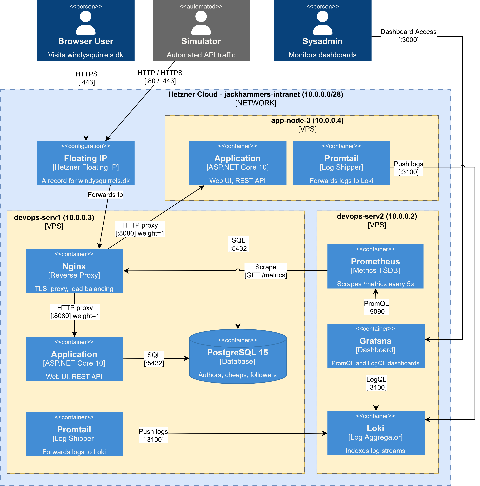

# ITU-MiniTwit — BSc DevOps, Software Evolution and Software Maintenance

**Group:** `BSc_group_m`  
**Repository:** `https://github.com/RonoITU/itu-devops2026-jackhammers`  
**Issue tracker:** `https://github.com/RonoITU/itu-devops2026-jackhammers/issues`  
**Monitoring dashboard:** `http://178.104.27.224:3000/d/chirp-aspnet-001/windysquirrels-monitoring-dashboard`  
**Logging dashboard:** `http://178.104.27.224:3000/d/app-logging-dashboard/windysquirrels-logging-dashboard`  

| Name | ITU ID |
|------|--------|
| Christian Philip Jørgensen | chpj@itu.dk |
| Jakob Sønder | jakso@itu.dk |
| Jacob Sponholtz | spon@itu.dk |
| Ronas Jacob Coban Olsen | rono@itu.dk |
| Rasmus Alexander Christiansen | ralc@itu.dk |

```{=latex}
\newpage
```

## 1. System's Perspective

### 1.1 Design and Architecture
*Author(s):* Rasmus

This section describes the overall system architecture of MiniTwit, including how the application is structured, deployed, and monitored. The diagram above provides a visual overview of the components and their interactions across the infrastructure.



MiniTwit is deployed across three Hetzner Cloud VPS nodes connected via a virtual private network (10.0.0.0/28).

**devops-serv1 (10.0.0.3)** is the primary node. Nginx runs here as the sole public entry point, handling TLS termination via Let's Encrypt, redirects HTTP traffic to HTTPS, and weighted load balancing across both app nodes. The primary application instance serves web UI and REST API traffic and exposes a /metrics endpoint for Prometheus. PostgreSQL 15 hosts the shared database for all application data. Promtail runs as a log shipping agent, collecting Docker container logs from this node and forwarding them to Loki on devops-serv2.  

**app-node-3 (10.0.0.4)** is the secondary application node. It runs an application replica that receives the majority of traffic from Nginx (weight=2) and connects to the shared PostgreSQL database on devops-serv1. Promtail runs here as well, shipping container logs to Loki on devops-serv2.  

**devops-serv2 (10.0.0.2)** is dedicated to observability. Prometheus scrapes the /metrics endpoint on devops-serv1 every five seconds and stores the resulting time-series data. Loki aggregates the structured log streams pushed by the Promtail agents on devops-serv1 and app-node-3. Grafana provides dashboards over both data sources using PromQL for metrics and LogQL for logs.  

### 1.2 Dependencies
*Author(s): *
<!-- List and briefly describe all technologies, frameworks, libraries, and tools your system
     depends on at all levels of abstraction (runtime, build, infrastructure, CI/CD, etc.).
     Example table: -->

| Technology / Tool | Version | Purpose |
|-------------------|---------|---------|
| <!-- e.g. Docker --> | <!-- 26.x --> | <!-- Containerisation --> |
| <!-- e.g. PostgreSQL --> | <!-- 16 --> | <!-- Relational database --> |
| <!-- ... --> | | |

### 1.3 Current State of the System
*Author(s): *
<!-- Describe the current state of the system. Include results from static analysis tools
     (e.g. SonarQube, golangci-lint, ESLint) and any quality assessments you have run.
     Reference specific metrics or screenshots where relevant. -->

---

## 2. Process' Perspective

### 2.1 CI/CD Pipeline
*Author(s): *

<!-- Describe and illustrate all stages and tools in your CI/CD pipeline, including how
     code is built, tested, and deployed/released to production.
     Include a diagram if helpful, e.g.:  -->

### 2.2 Monitoring
*Author(s): *

<!-- Describe how you monitor your system and what precisely you monitor
     (metrics, alerts, dashboards, tools used — e.g. Prometheus, Grafana). -->

### 2.3 Logging
*Author(s): *

<!-- Describe what you log in your system, how logs are collected, aggregated,
     and queried (e.g. ELK stack, Loki/Grafana, Fluentd). -->

### 2.4 Security Hardening
*Author(s): *

<!-- Briefly describe the measures taken to security-harden your system
     (e.g. secrets management, network policies, dependency scanning, HTTPS, least-privilege). -->

### 2.5 Availability and Scaling
*Author(s): *

<!-- Describe how you handle availability and scaling
     (e.g. load balancing, horizontal scaling, health checks, rolling deployments). -->

---

## 3. Reflection Perspective

### 3.1 Evolution and Refactoring
*Author(s): Jakob Sønder

<!-- Describe the biggest challenges encountered when evolving and refactoring the system.
     How were they solved? Link to relevant commits, issues, or PRs. -->

#### Migrating away from a the Python Flask framework:

 This was solved in PR [#2](https://github.com/RonoITU/itu-devops2026-jackhammers/pull/2) and [#3](https://github.com/RonoITU/itu-devops2026-jackhammers/pull/3). A working ASP.NET application meeting similar requirements was utilized. All dependencies were upgraded to target the newest long-term ASP.NET version .NET 10.

#### Switching from SQLite to PostgreSQL:

This was solved in PR [#8](https://github.com/RonoITU/itu-devops2026-jackhammers/pull/8). We wanted to prepare for the possibility of a production setup, where multiple containers or applications can connect to the same database over a network. The biggest challenge was that earlier EF core migrations were created for SQLite specifically. Since the switch was done before production, this was not an issue (see [docs](https://github.com/RonoITU/itu-devops2026-jackhammers/blob/main/docs/Switch-to-postgres.md) for considerations).

### 3.2 Operation
*Author(s): *

<!-- Describe the biggest operational challenges and how they were resolved.
     Link to relevant incidents, runbooks, or monitoring alerts. -->

### 3.3 Maintenance
*Author(s): *

<!-- Describe challenges related to maintaining the system over the term
     (dependency updates, technical debt, documentation, etc.).
     Link to relevant issues or commits. -->

### 3.4 DevOps Reflection
*Author(s): *

<!-- Reflect on the "DevOps" style of your work. What did you do differently compared to
     previous development projects? What worked well and what did not? -->

---

## 4. Use of Generative AI
*Author(s):* Rasmus

**GitHub Copilot** was used to assist with boilerplate code generation throughout development. It provided inline auto-completion that often matched the intended behavior being implemented, and helped untangle unfamiliar functionality across the broader codebase. This sped up the coding process significantly, particularly for repetitive or structurally predictable code.

**Microsoft Copilot** was used for general consultation when extending the infrastructure, serving as a quick reference for exploring options and approaches before committing to a direction.

**Claude** was used for more in-depth technical discussions, typically involving specific code examples. It helped provide clarity on complex topics and was particularly useful when a concept required more thorough explanation than a quick search could offer.

<!-- Reflection if word count allows: -->
 
<!-- Did the tools speed up your work? Did they introduce errors or bad
     practices that you had to fix? What would you do differently? -->