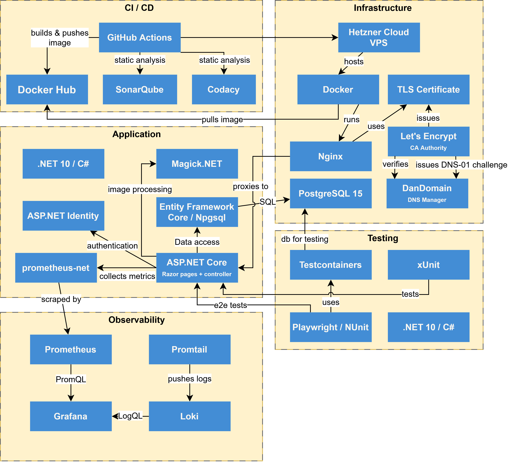
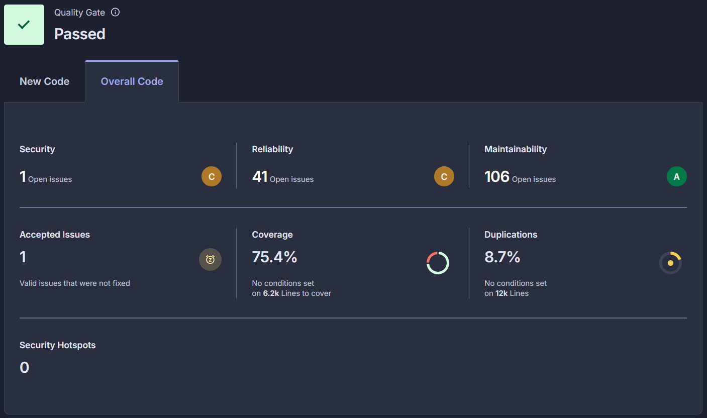
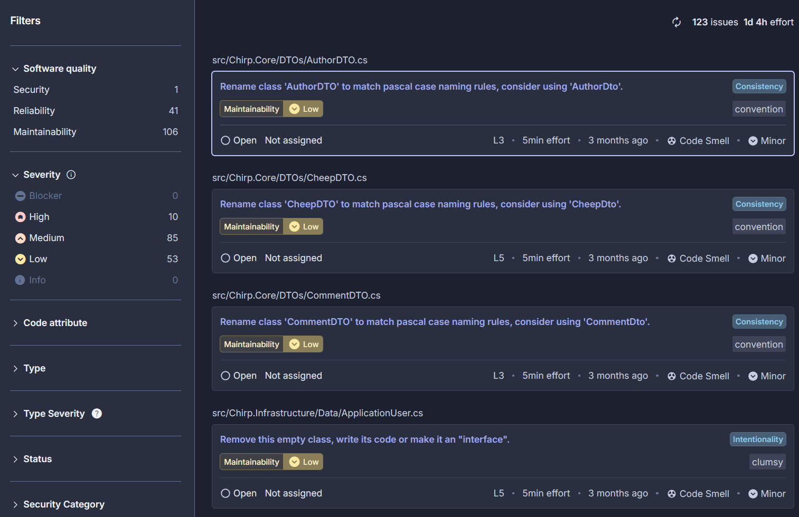
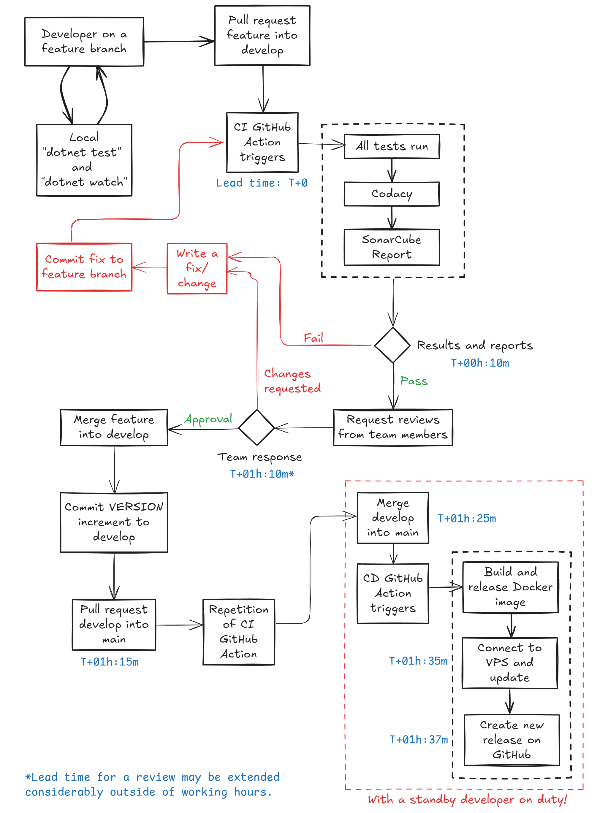

# ITU-MiniTwit — BSc DevOps, Software Evolution and Software Maintenance

**Group:** `BSc_group_m`  
**Repository:** `https://github.com/RonoITU/itu-devops2026-jackhammers`  
**Issue tracker:** `https://github.com/RonoITU/itu-devops2026-jackhammers/issues`  
**Monitoring dashboard:** `http://178.104.27.224:3000/d/chirp-aspnet-001/windysquirrels-monitoring-dashboard`  
**Logging dashboard:** `http://178.104.27.224:3000/d/app-logging-dashboard/windysquirrels-logging-dashboard`  


```{=latex}
\setlength{\LTleft}{\fill}
\setlength{\LTright}{\fill}
```

| Name | ITU ID |
|:------|:--------|
| Christian Philip Jørgensen | chpj@itu.dk |
| Jakob Sønder | jakso@itu.dk |
| Jacob Sponholtz | spon@itu.dk |
| Ronas Jacob Coban Olsen | rono@itu.dk |
| Rasmus Alexander Christiansen | ralc@itu.dk |

```{=latex}
\setlength{\LTleft}{0pt}
\setlength{\LTright}{\fill}
```

```{=latex}
\newpage
```

## 1. System's Perspective

### 1.1 Design and Architecture
*Author(s): Rasmus Alexander Christiansen*

This section describes the overall system architecture of MiniTwit, including how the application is structured, deployed, and monitored. The diagram above provides a visual overview of the components and their interactions across the infrastructure.


MiniTwit is deployed across three Hetzner Cloud VPS nodes connected via a virtual private network (10.0.0.0/28).

**devops-serv1 (10.0.0.3)** is the primary node. Nginx runs here as the sole public entry point, handling TLS termination via Let's Encrypt, redirects HTTP traffic to HTTPS, and weighted load balancing across both app nodes. The primary application instance serves web UI and REST API traffic and exposes a /metrics endpoint for Prometheus. PostgreSQL 15 hosts the shared database for all application data. Promtail runs as a log shipping agent, collecting Docker container logs from this node and forwarding them to Loki on devops-serv2.  

**app-node-3 (10.0.0.4)** is the secondary application node. It runs an application replica that receives the majority of traffic from Nginx (weight=2) and connects to the shared PostgreSQL database on devops-serv1. Promtail runs here as well, shipping container logs to Loki on devops-serv2.  

**devops-serv2 (10.0.0.2)** is dedicated to observability. Prometheus scrapes the /metrics endpoint on devops-serv1 every five seconds and stores the resulting time-series data. Loki aggregates the structured log streams pushed by the Promtail agents on devops-serv1 and app-node-3. Grafana provides dashboards over both data sources using PromQL for metrics and LogQL for logs.  

### 1.2 Dependencies
*Author(s): Rasmus Alexander Christiansen*

The diagram below illustrates the relationships between the key technologies across all layers of the system. Not every dependency is shown - minor libraries and transitive dependencies are omitted for clarity. A full list with descriptions is provided in the tables below the diagram.



**Application**

| Technology / Tool | Purpose |
|---|---|
| C# / .NET | Application language and runtime |
| ASP.NET Core (Razor Pages) | Web UI framework |
| ASP.NET Core (Controllers) | REST API for the simulator |
| Entity Framework Core | ORM and database migrations |
| Npgsql EF Core Provider | PostgreSQL driver for EF Core |
| ASP.NET Core Identity | User authentication and account management |
| prometheus-net | Exposes application metrics to Prometheus |
| Magick.NET | Profile image processing |
| SixLabors.ImageSharp | Image resizing and encoding |

**Infrastructure**

| Technology / Tool | Purpose |
|---|---|
| Hetzner Cloud | VPS hosting for all three nodes |
| Docker | Container runtime on all nodes |
| Docker Compose | Service orchestration on each node |
| Nginx | Reverse proxy, TLS termination, load balancing |
| PostgreSQL | Relational database |
| Let's Encrypt / Certbot | Automated TLS certificate provisioning |

**Observability**

| Technology / Tool | Purpose |
|---|---|
| Prometheus | Metrics scraping and time-series storage |
| Grafana | Dashboards for metrics and logs |
| Loki | Log aggregation and indexing |
| Promtail | Log shipping agent (Docker container logs) |

**CI/CD**

| Technology / Tool | Purpose |
|---|---|
| GitHub Actions | CI/CD pipeline automation |
| Docker Hub | Container image registry |
| SonarQube (SonarCloud) | Static analysis and quality gate |
| Codacy | Additional static analysis |
| Pandoc + XeLaTeX | Report PDF generation |

**Testing**

| Technology / Tool | Purpose |
|---|---|
| xUnit | Unit and integration test framework |
| NUnit + Playwright | End-to-end browser testing |
| Testcontainers | Spins up a PostgreSQL instance for tests |
| coverlet | Code coverage collection |


### 1.3 Current State of the System
*Author(s): Rasmus Alexander Christiansen*

The current state of the system is assessed through two static analysis tools integrated into the CI pipeline: SonarCloud and Codacy. Both run automatically on every pull request. Rather than blocking merges on quality gate failure (`continue-on-error: true` in the pipeline), the team has deliberately prioritised visibility over enforcement - the goal being that issues are made transparent and trackable, not that velocity is sacrificed to a strict gate.

**SonarCloud**

SonarCloud provides a continuous quality assessment of the codebase across security, reliability, maintainability, coverage, and duplications.



It is worth noting that the project was inherited from a 1.5 year old codebase originally written by students in the third-semester BDSA course. As a result, a significant portion of the issues identified by SonarCloud reflect legacy code rather than code introduced during this course. The team has primarily focused on resolving security issues and issues affecting performance, while reliability, maintainability, and code duplication issues in the inherited code have not been a priority.

The overall results show 1 security issue, 41 reliability issues, 106 maintainability issues, 75.4% test coverage, and 8.7% code duplication. There are 0 security hotspots and all hotspots have been reviewed.

The Issues view illustrates what this visibility looks like in practice:



SonarCloud surfaces concrete, prioritised issues directly tied to source locations - for example, flagging that `AuthorDTO` in `src/Chirp.Core/DTOs/AuthorDTO.cs` should be renamed to `AuthorDto` to conform to Pascal case naming conventions. Before static analysis was introduced, issues like this existed in the codebase but were invisible. They are now explicit, categorised by severity, and can be worked through systematically.

**Codacy**

Codacy runs as a secondary static analysis tool in the CI pipeline alongside SonarCloud, providing an independent second opinion on code quality. It does not currently expose a public dashboard, but its results are available in the pipeline logs on every run.

---

## 2. Process' Perspective

### 2.1 CI/CD Pipeline
*Author(s): Ronas Olsen and Jacob Sponholtz*

<!-- Describe and illustrate all stages and tools in your CI/CD pipeline, including how
     code is built, tested, and deployed/released to production.
     Include a diagram if helpful, e.g.:  -->



The source code is hosted on GitHub.
We follow a modified GitFlow branching strategy: Feature development on a `develop` branch and feature branches, but without the use of release branches.
Instead `develop` is merged directly to the main branch on release, and all QA is handled as part of the CI of features to the  `develop` branch. 

The main branch is the version currently in production.
Versions are also tagged semi-automatically by the CD workflow with each new release. 

Any contributor can clone the repository, create a new feature branch, and work using their preferred tools.
Simple instructions are provided in the README on how to build, run and test locally.
To integrate a feature into the next release, the contributor opens a pull request towards `develop`.
This triggers the CI GitHub Action to run our testing suite (Unit, Integration, E2E) and static analysis tools (SonarCube, Codacy) so that we will have concrete QA evidence alongside the changes to review. 

The contributor will also get immediate feedback from the analysis tool, indicating any new issues and the test coverage on new code.
Once the contributor is happy with the new feature(s), we ask for the feature branch to be merged.

To deploy a new release, the developer must first assert the new commits on `develop`, increment the VERSION file acordningly, and open a pull-request towards main.
This pull-request first triggers the CI GitHub Action. When this action has been completed succesfully, the developer can merge towards main.
The merge triggers the CD actions, in which a new Docker image is built and uploaded to Docker Hub.
Github then connects to the server via ssh to recreate and restart the containers, using the new release image.

Finally the CD action will tag the release with version number, and create a new release on GitHub.

### 2.2 Monitoring
*Author(s): Ronas Olsen, Jacob Sponholtz and Rasmus Alexander Christiansen*

System monitoring is based on Prometheus and Grafana. 
Prometheus collects metrics from app containers over the VPN. 
Grafana is setup to poll for this data as needed for dashboard information on our app service. 
This is done on a system monitoring dashboard and a business intelligence (BI) dashboard. 

The most important metrics on the monitoring dashboard are HTTP traffic, error rate, request rate, latency, memory and CPU usage.
In the BI dashboard, the hightlights are a top 10 most followed, total users versus active users, total messages and avarage followers per user. (See [logging-dashboard.gif](images/logging-dashboard.gif) and [monitoring-dashboard.gif](images/monitoring-dashboard.gif) for reference.)


<!-- Describe how you monitor your system and what precisely you monitor
     (metrics, alerts, dashboards, tools used — e.g. Prometheus, Grafana). -->

### 2.3 Logging
*Author(s): Ronas Olsen, Jacob Sponholtz and Rasmus Alexander Christiansen*

<!-- Describe what you log in your system, how logs are collected, aggregated,
     and queried (e.g. ELK stack, Loki/Grafana, Fluentd). -->

Logs are collected from Docker containers on each VPS using Loki and Prometheus. The standard outputs from each container are directed to an instance of Prometheus. Loki running on the monitoring server collects data from these for Grafana to access as needed for dashboards or for Drilldown. All log entries have a UTC timestamp appended automatically. (See [logging-dashboard.gif](images/logging-dashboard.gif) for reference.)

### 2.4 Security Hardening
*Author(s): *

<!-- Briefly describe the measures taken to security-harden your system
     (e.g. secrets management, network policies, dependency scanning, HTTPS, least-privilege). -->

### 2.5 Availability and Scaling
*Author(s): *

<!-- Describe how you handle availability and scaling
     (e.g. load balancing, horizontal scaling, health checks, rolling deployments). -->

---

## 3. Reflection Perspective

### 3.1 Evolution and Refactoring
*Author(s): *

<!-- Describe the biggest challenges encountered when evolving and refactoring the system.
     How were they solved? Link to relevant commits, issues, or PRs. -->

### 3.2 Operation
*Author(s): *

<!-- Describe the biggest operational challenges and how they were resolved.
     Link to relevant incidents, runbooks, or monitoring alerts. -->

### 3.3 Maintenance
*Author(s): *

<!-- Describe challenges related to maintaining the system over the term
     (dependency updates, technical debt, documentation, etc.).
     Link to relevant issues or commits. -->

### 3.4 DevOps Reflection
*Author(s): *

<!-- Reflect on the "DevOps" style of your work. What did you do differently compared to
     previous development projects? What worked well and what did not? -->

---

## 4. Use of Generative AI
*Author(s):* Rasmus

**GitHub Copilot** was used to assist with boilerplate code generation throughout development. It provided inline auto-completion that often matched the intended behavior being implemented, and helped untangle unfamiliar functionality across the broader codebase. This sped up the coding process significantly, particularly for repetitive or structurally predictable code.

**Microsoft Copilot** was used for general consultation when extending the infrastructure, serving as a quick reference for exploring options and approaches before committing to a direction.

**Claude** was used for more in-depth technical discussions, typically involving specific code examples. It helped provide clarity on complex topics and was particularly useful when a concept required more thorough explanation than a quick search could offer.

<!-- Reflection if word count allows: -->
 
<!-- Did the tools speed up your work? Did they introduce errors or bad
     practices that you had to fix? What would you do differently? -->